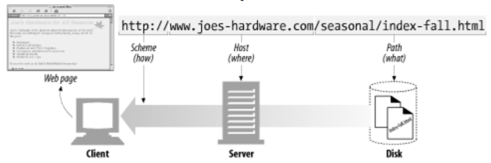
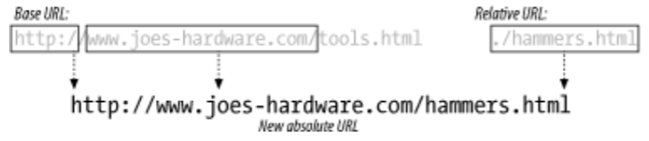
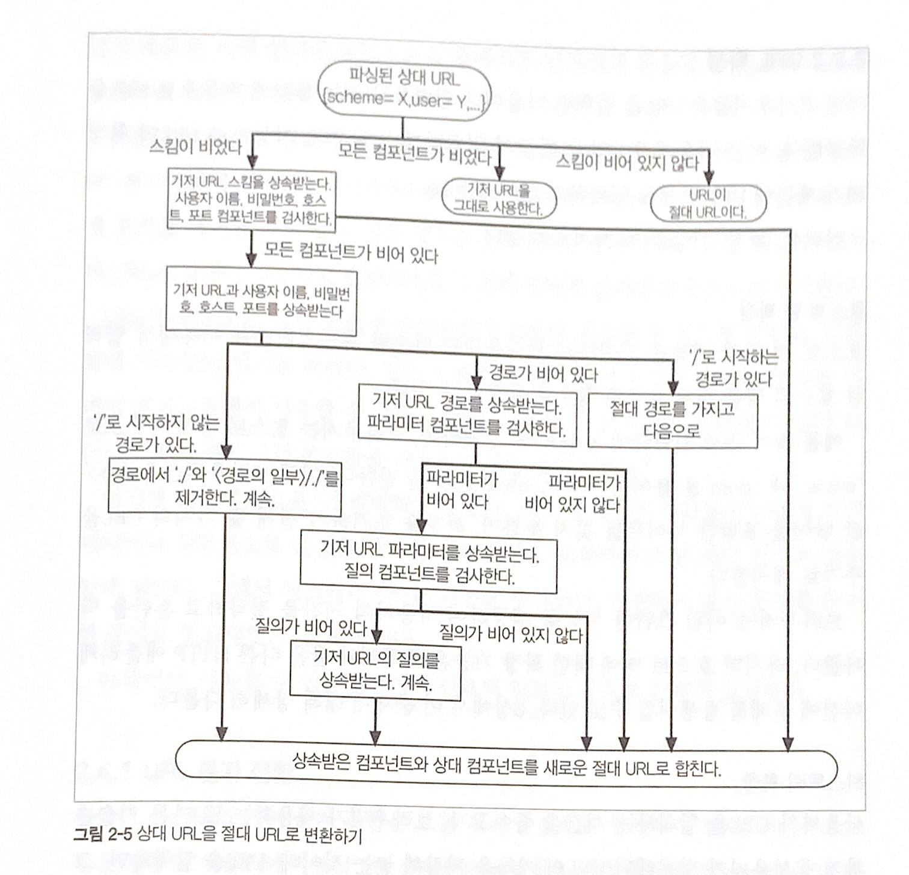

# 2장 URL과 리소스

## 2.1 인터넷의 리소스 탐색하기

- URL(Uniform Resource Locator) : 인터넷 리소스를 가리키는 표준 이름, 위치

- URI = URL + URN
  
  - URI (Uniform Resource Identifier)
  
  - URN (Uniform Resource Name)

- URL = 스킴 + 서버위치 + 경로

## 2.2 URL 문법

`<스킴>://<사용자이름>:<비밀번호>@<호스트>:<포트>/<경로>;<파라미터>?<질의>#<프래그먼트>`

| 컴포넌트    | 설명                                                                                                      | 기본값       |
| ------- | ------------------------------------------------------------------------------------------------------- | --------- |
| **스킴**  | 리소스를 가져오려면 어떤 프로토콜을 사용하여 서버에 접근해야 하는지를 가리킴 (HTTP, FTP, SMTP)                                            | 없음        |
| 사용자이름   | 몇몇 스킴(FTP)은 리소스에 접근 하기 위해 사용자 이름이 필요함                                                                   | anonymous |
| 비밀번호    | 사용자의 비밀번호를 가리키며, 사용자 이름에 콜론(:)으로 이어서 기술함                                                                | <이메일주소>   |
| **호스트** | 리소스를 호스팅하는 서버의 호스트 명이나 IP 주소                                                                            | 없음        |
| 포트      | 리소스를 호스팅하는 서버가 열어놓은 포트 번호. 많은 스킴이 기본 포트를 가지고 있음 (HTTP 기본 포트는 80)                                        | 스킴에 따라 다름 |
| **경로**  | 이전 컴포넌트와 빗금(/)으로 구분함. 리소스가 서버 내 어디에 있는지를 가리킴. 경로 컴포넌트의 문법은 서버와 스킴에 따라 다름 (URL의 경로를 세그먼트로 나눌 수 있음*)      | 없음        |
| 파라미터    | 특정 스킴들에서 입력 파라미터를 기술하는 용도로 사용됨. 파라미터는 이름/값을 쌍으로 가짐. 다른 파라미터나 경로의 일부와 세미콜론(;)으로 구분하여 기술하며, 여러 개를 가질 수 있음 | 없음        |
| 질의      | 스킴에서 애플리케이션(데이터베이스, 게시판, 검색엔진, 기타 인터넷 게이트웨이)에 파라미터를 전달하는 데 쓰임. 공통 포맷은 없음. URL 끝에 "?"로 구분함               | 없음        |
| 프래그먼트   | 리소스 조각이나 일부를 가리키는 이름. URL이 특정 객체를 가리킬 경우에 프래그먼트 필드는 서버에 전달되지 않음. 이는 클라이언트에서만 사용함. URL 끝에서 "#" 문자로 구분함   | 없음        |

- 파라미터; 리소스의 포맷
  
  - 바이러니 이미지 / 텍스트
  
  - ex. `;type=d`

- 질의 문자열; 리소스 형식의 범위
  
  - 서버의 게이트웨이 어플리케이션이 대답
  
  - ex. `?item=12731&color=blue`

- 프래그먼트; 리소스의 특정 부분
  
  - 서버는 객체 전체 단위로 전송
  
  - 클라이언트에서 조정
  
  - `#drills`

## 2.3 단축 URL

- 절대 URL; 리소스에 접근하는데 필요한 모든 정보를 포함

- 상대 URL
  
  - 기저(base)라고하는 다른 URL을 사용
  
  - URL을 짧게 표기하는 방식

- 상대 URL과 절대 URL 간에 상호 변환
  
  브라우저와 같은 어플리케이션에서 이루어짐
  
  기저 URL 확인
  
  - 리소스에서 명시적으로 제공
  
  - 해당 리소스의 URL을 기저 URL로 사용
  
  - 기저 URL이 없는 경우

- URL 확장
  
  - 호스트 명 확장
    
    - yahoo를 `www.yahoo.com`으로
  
  - 히스토리 확장
    
    - http://www.joes-를 `http://www.joes-hardware.com`으로

## 2.4 안전하지 않은 문자

- 안전하게 URL을 전송할 수 있도록 특정 문자들이 금지됨
  
  - 전자메일에 사용되는 SMTP (Simple Mail Transfer Protocol)는 7비트 인코딩을 사용되기에 8비트 시앙의 인코딩 정보가 소실됨
  
  - '이스케이프'라는 기능을 통하여 안전하지 않은 문자를 안전하게 인코딩 가능하게함

- URL 문자 집합과 인코딩 체계
  
  - 역사적으로 영문 기반의 US-ASCII를 사용
  
  - 이진 데이터를 포함하고 비영미권 언어를 지원하기 위해 이스케이프 문자 설계
    
    - % 뒤에 해당 문자의 ASCII코드를 추가하여 표현

| 문자   | ASCII 코드   | 표현  |
| ---- | ---------- | --- |
| ~    | 126 (0x7E) | %7E |
| 빈 문자 | 32 (0x20)  | %20 |
| %    | 37 (0x25)  | %25 |

- 문자 제한

| 문자              | 선점 및 제한                                        |
| --------------- | ---------------------------------------------- |
| %               | 인코딩된 문자에 사용할 이스케이프 토큰으로 선점                     |
| /               | 경로 컴포넌트에 있는 경로 세그먼트를 나누는 용도                    |
| .               | 경로 컴포넌트에서 선점                                   |
| ..              | 경로 컴포넌트에서 선점                                   |
| #               | 프래그먼트의 구획 문자로 선점                               |
| ?               | 질의 문자열의 구획 문자로 선점                              |
| ;               | 파라미터의 구획 문자로 선점                                |
| :               | 스킴, 사용자 이름/ 비밀번호, 호스트/포트의 구획 문자로 선점            |
| $ , +           | 선점                                             |
| @ & =           | 특정 스킴에서 특별한 의미가 있기 때문에 선점                      |
| {} \| \ ~ [ ] ` | 게이트웨이와 같은 여러 전송 에이전트에서 불안전하게 다루기 때문에 제한        |
| <> ""           | 안전하지 않음. URL 범위 밖에서 역할이 있는 문자이기 떄문에 반드시 인코딩해야함 |
| 0x00-0x1F, 0x7F | 제한됨. 인쇄되지 않는 US-ASCII 문자                       |
| > 0x7F          | 제한됨. 7비트 US-ASCII 문자가 아님                       |

- 사용에 문제가 되지 않을 수 있지만 이는 명확하지 않은 표현 방식이며 안전하지 않음

## 2.5 스킴의 바다

- http, https를 포함한 유명 스킴에 대한 정보 `44p, 45p`

## 2.6 미래

- URL은 주소이며 한계가 있음 따라서 해당 객체를 직접 반환하는 URN이 개발되었음
  
  - 웹 서버에서 이동이 이루어지더라도 해당 객체를 반환할 수 있음

- 그러나 주소 체계 변경은 큰 작업이며 긴급한 사안이 아니기에 URL이 사용될 것
