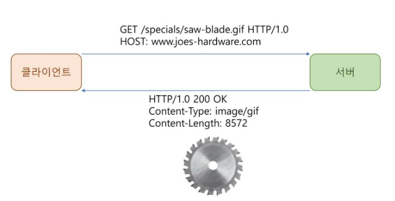
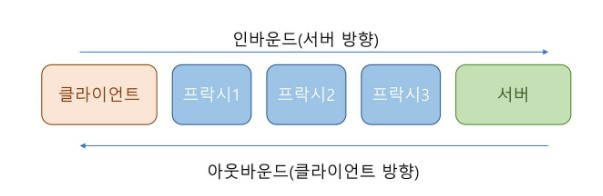

# 3장 HTTP 메시지

## 3.1 메시지의 흐름
- HTTP 메시지 
  - HTTP 애플리케이션 간에 주고받은 데이터의 블록들
  - 모든 HTTP의 메시지는 요청메시지와 응답메시지로 구성된다.
  - 요청메시지 : 서버의 동작 요구
  - 응답메시지 : 서버의 결과 -> 클라이언트에게 전송
  

  ```
  # 요청메시지 형식
  <메서드> <요청URL> <버전>
  <헤더>

  <엔터티 본문>

  # 응답 메시지 형식
  <버전> <상태코드> <사유구절>
  <헤더>

  <엔터티 본문>

  # 상세한 정보는 뒤에서 다룰 것
  ```


  ### 메시지의 트랜잭션
  #### 1. 인바운드와 아웃바운드
    - 메시지 -> 서버 (인바운드)  [데이터 요청]
    - 서버 -> 메시지 (아웃바운드) [데이터 처리 후 메세지 전송]
    <br>
    
    <br>
    
  #### 2. 다운스트림
    - 요청이냐 응답이냐에 관계없이 메세지는 다운스트림으로 흐름


## 3.2 메시지의 각 부분
```
## 시작줄 : 어떤 메시지인지 설명
HTTP/1.0 200 OK 
## 헤더 : 메시지의 속성
Content-type : text/plain
Content-length : 19
## 본문 : 선택적인 데이터
Hi! I'm a message!
```
### 3.2.2 시작줄
- 요청줄
ex) GET /text/hi-there.txt HTTP/1.1
<br>
- 응답줄 
ex) HTTP/1.0 200 OK
<br>

  - **메서드**
    - 요청의 시작줄에서 사용
          
      | 메서드  | 설명                                                   | 메세지 본문이 있는가? |
      | ------- | ------------------------------------------------------ | --------------------- |
      | GET     | 서버에서 어떤 문서를 가져온다                          | 없음                  |
      | HEAD    | 서버에서 어떤 문서에 대한 헤더만 가져온다              | 없음                  |
      | POST    | 서버가 처리해야 할 데이터를 보낸다                     | 있음                  |
      | PUT     | 서버에 요청 메세지의 본문을 저장한다                   | 있음                  |
      | TRACE   | 메세지가 프락시를 거쳐 서버에 도달하는 과정을 추적한다 | 없음                  |
      | OPTIONS | 서버가 어떤 메서드를 수행할 수 있는지 확인한다         | 없음                  |
      | DELETE  | 서버에서 문서를 제거한다                               | 없음                  |

  - **상태코드**
    - 클라이언트에게 무엇이 일어났는지 말해줌

      | 전체 범위 | 정의된 범위 | 분류            |
      | --------- | ----------- | --------------- |
      | 100 - 199 | 100 - 101   | 정보            |
      | 200 - 299 | 200 - 206   | 성공            |
      | 300 - 399 | 300 - 305   | 리다이렉션      |
      | 400 - 499 | 400 - 415   | 클라이언트 에러 |
      | 500 - 599 | 500 - 505   | 서버 에러       |

  - 사유구절
    - 상태코드의 글로 된 설명 ex) OK, Unauthorized
  - 버전번호 
    - HTTP 어플리케이션들이 따르는 프로토콜 버전
    - HTTP/x.y 형식으로 표기 (2.22버전은 2.3버전보다 높음) -> x,y 각각으로 판단


## 3.3 메서드


## 3.4 상태코드 
출처 : Tech-Book-Learning
 
* `100-199` : **정보성상태코드**
* `100` : **Continue**, 시작 부분의 일부 수용, 나머지 제공해야 함
* `101` : **Switching Protocols** 서버가 프로토콜을 수정했음을 의미 
* `200` : **Ok**, 요청은 정상이고 엔티티 본문은 리소스를 포함하고 있다
* `201` : **Created**, 서버 개체를 생성(PUT) 하라는 요청을 위한 것. 응답으로는 **구체적인 Location 헤더**와 함께, 그 **리소스를 참조할 수 있는 URL**을 엔티티 본문에 포함해야 한다. 서버가 반드시 생성한 후에 응답해야 한다.
* `202` : **Accepted**, 요청은 받아들여졌으나 서버는 아직 그에 대한 어떤 동작을 수행하지 않았다. 그래서, **응답 본문에 요청이 언제 완료될 것인지에 대한 추정과 그 정보**를 어디서 얻을 수 있는지 포함해야 한다.
* `203` : **Non-Authoritative Information**, 엔티티 헤더에 있는 정보가 원래 서버가 아닌 리소스의 사본에서 왔다는 응답
* `204` : **No Content**, 응답 메세지는 헤더와 상태줄을 포함하지만 Content는 표시하지 않는다. 주로 웹브라우저를 새 문서로 이동하지 않고 갱신할 때 사용
* `205` : **Reset Content**, 주로 브라우저를 위해 사용되는 또 하나의 코드, 브라우저에게 현재 페이지에 있는 HTML 폼을 지우라고 안내할 때 사용
* `206` : **Partial Content**, 부분 혹은 범위 요청이 성공했다. 이 응답은 반드시 Content-Range와 Date 헤더를 반드시 포함하고, Content-Location도 포함해야 한다

그 다음으로는 `리다이렉션 코드`,

* `300` : **Multiple Choices**, Client가 동시에 여러 리소스를 가르키는 URL을 요청한 경우, 리소스 목록을 같이 반환한다.
* `301` : **Moved Permantely**, 요청한 URL이 옮겨졌을 때 사용한다. 응답은 **Location 헤더에 현재 리소스가 존재하는 URL을 포함**해야 한다. 
* `302` : **Found**, 301 상태코드와 같지만 Location 헤더로 주어진 URL을 Client가 임시로 사용해야 한다
* `303` : **See Other**, Client에게 리소스를 다른 URL에서 가져와야 한다고 말해주고자 할 때 쓰인다.  URL을 응답 메세지에 Location 헤더로 명시해야 한다
* `304` : **Not Modified**, Client는 헤더를 이용해서 조건부 요청을 만들 수 있다
* `305` : **Use proxy**, 리소스가 반드시 proxy를 통해서 접근되어야 함을 알린다. **Location 헤더에 마찬가지로 URL을 명시**해야 한다

그 다음으로는 `클라이언트 에러 상태 코드`,

* `400` : **Bad Request**, 클라이언트가 잘못된 요청을 보냈다
* `401` : **Unauthorized**, 리소스를 얻기 전에 클라이언트가 인증해야 한다를 알리는 코드.
* `402` : **Payment Required**, 현재 사용되지 않지만 미래를 위해 남겨둔 코드
* `403` : **Forbidden**, 요청이 서버에 의해서 거부되었음을 알리는 코드. 거절의 이유는 응답 본문에 숨기기 위해 사용한다
* `404` : **Not Found**, 서버가 요청한 URL을 찾을 수 없음을 알리기 위한 코드
* `405` : **Method Not Allowed**, 요청한 URL에 대하여 지원하지 않는 메서드로 요청받았을 때 사용한다
* `406` : **Not Acceptable**, 주어진 URL에 대한 리소스 중 클라이언트가 받아들일 수 있는 것이 없는 경우 사용한다
* `407` : **Proxy Authentication Required**, 401 상태 코드와 같으나 리소스에 대한 인증을 Proxy 서버로 요청하라는 의미
* `408` : **Request Timeout**, 클라이언트의 요청을 완수하기에 너무나 많은 시간이 걸리는 경우
* `409` : **Request Conflict**, 요청이 리소스에 대해 일으킬 수 있는 충돌을 지정하기 위해 사용. 서버는 충돌에 대해 염려하는 부분을 본문에 작성해야 함
* `410` : **Gone**, 404와 비슷하나 서버가 한때 리소스를 가지고 있었다 라는 점이 다름.
* `411` : **Length Required**, 서버가 요청 메세지에 대하여 **Content-Length**를 명시해달라는 용도로 사용
* `412` : **Precondition Failed**, 클라이언트가 조건부 요청을 했는데, 그 중 하나가 실패했을 때 사용. 조건부 요청은 Except 헤더를 포함한 경우를 의미한다
* `413` : **Request Entity Too Large**, 서버가 처리할 수 있는 혹은 처리하고자 하는 한계를 넘은 크기의 요청을 클라이언트가 보냈을 때 사용
* `414` : **Request URI Too Long**, 서버가 처리할 수 있는 혹은 처리하고자 하는 한계를 넘은 길이의 URL을 보낸 경우 사용
* `415` : **Unsupported Media Type**, 서버가 이해하거나 지원하지 못하는 내용 유형의 엔티티를 클라이언트가 보냈을 때 사용
* `416` : **Required Range Not Satisfiable**, 요청 메세지가 리소스의 특정 범위를 요청했는데, 그 범위가 맞지 않을 때 사용
* `417` : **Exception Failed**, 요청에 포함된 Except 헤더에 서버가 만족시킬 수 있는 기대가 없는 경우 사용

그 다음으로는 `서버 에러 상태 코드` ,

* `500` : Internal Server Error, 서버가 요청을 처리할 수 없게 만드는 에러를 만났을 때 사용
* `501` : Not Implemented, 클라이언트가 서버의 능력을 넘은 요청을 했을 때 사용
* `502` : Bad Gateway, 프락시나 게이트웨이처럼 연결고리에 있는 응답 연쇄에 가짜 응답을 받았을 때 사용
* `503` : Service Unavailable, 현재 서버가 요청을 처리할 수 없지만 나중에는 가능함을 의미함. 응답 본문에 **Retry-After 헤더를 포함**해야 함
* `504` : Gateway Timeout, 상태 코드는 408과 비슷하지만 타임아웃이 Gateway나 Proxy에서 발생
* `505` : HTTP Version Not Supported, 서버가 지원할 수 없는 Protocol임을 의미할 때 사용

## 3.5 헤더

    


