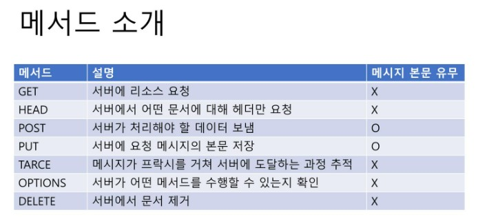
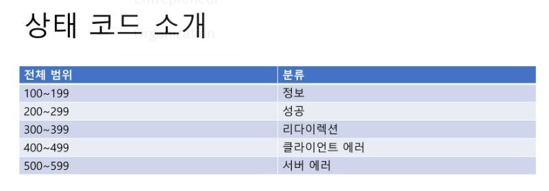

# 3장 HTTP 메시지

## 3.1 메시지의 흐름
- HTTP 메시지 
  - HTTP 애플리케이션 간에 주고받은 데이터의 블록들
  - 모든 HTTP의 메시지는 요청메시지와 응답메시지로 구성된다.
  - 요청메시지 : 서버의 동작 요구
  - 응답메시지 : 서버의 결과 -> 클라이언트에게 전송
  
  
  ```
  # 요청메시지 형식
  <메서드> <요청URL> <버전>
  <헤더>

  <엔터티 본문>

  # 응답 메시지 형식
  <버전> <상태코드> <사유구절>
  <헤더>

  <엔터티 본문>

  # 상세한 정보는 뒤에서 다룰 것
  ```


  ### 메시지의 트랜잭션
  #### 1. 인바운드와 아웃바운드
    - 메시지 -> 서버 (인바운드)  [데이터 요청]
    - 서버 -> 메시지 (아웃바운드) [데이터 처리 후 메세지 전송]
    <br>
    
    <br>
    
  #### 2. 다운스트림
    - 요청이냐 응답이냐에 관계없이 메세지는 다운스트림으로 흐름


## 3.2 메시지의 각 부분
```HTTP
## 시작줄 : 어떤 메시지인지 설명
HTTP/1.0 200 OK 
## 헤더 : 메시지의 속성
Content-type : text/plain
Content-length : 19
## 본문 : 선택적인 데이터
Hi! I'm a message!
```
### 3.2.2 시작줄
- 요청줄
ex) GET /text/hi-there.txt HTTP/1.1
<br>
- 응답줄 
ex) HTTP/1.0 200 OK
<br>

  - **메서드**
    - 요청의 시작줄에서 사용
    
  - **상태코드**
    - 클라이언트에게 무엇이 일어났는지 말해줌
    
  - 사유구절
    - 상태코드의 글로 된 설명 ex) OK, Unauthorized
  - 버전번호 
    - HTTP 어플리케이션들이 따르는 프로토콜 버전
    - HTTP/x.y 형식으로 표기 (2.22버전은 2.3버전보다 높음) -> x,y 각각으로 판단

### 

    


