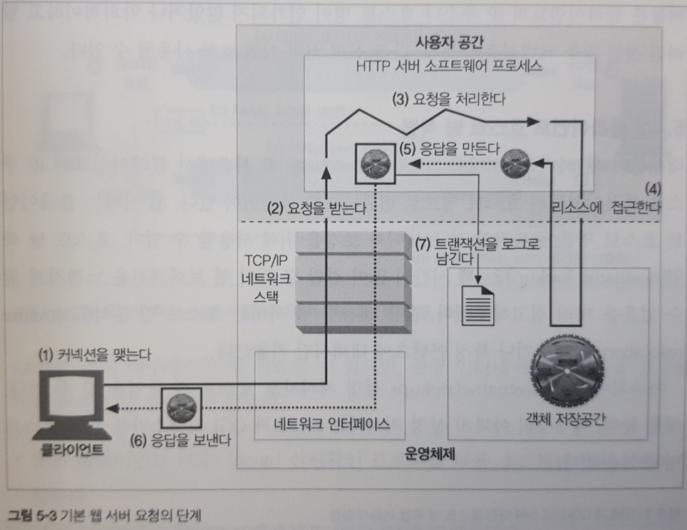
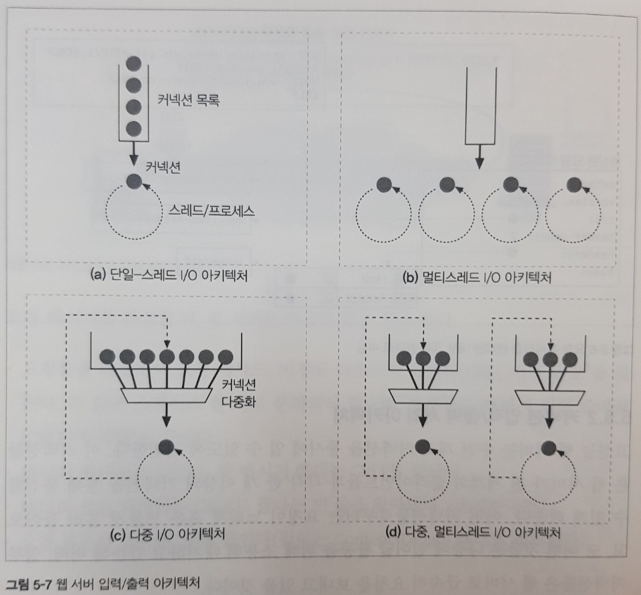

# 5장. 웹 서버

2부는 HTTP 아키텍처에 관한 내용으로 그 중 5장 웹서버는 웹 서버 아키텍처에 대해 개략적으로 설명한다.

### 1. 웹 서버란?

- 소프트웨어와 웹페이지를 제공하는 하드웨어 양쪽 모두를 의미한다.
- 주된 역할은 리소스에 대한 HTTP 요청을 받아서 콘텐츠를 클라이언트에게 돌려주는 일을 한다.

### 2. 구체적인 작동방식

- 총 7단계로 작업이 진행된다.

### 1단계: 커넥션을 맺는다.

- HTTP 요청이 들어오면 커넥션을 맺고 클라이언트를 확인하고 오가는 데이터를 지켜보기 위한 준비를 합니다.
- 그 과정중 웹 서버는 보안을 목적으로 어떤 커넥션이든 마음대로 거절하거나 즉시 닫을 수 있습니다.

### 2단계(1): 요청을 받는다.

- 커넥션에 데이터가 도착하면, 웹 서버는 네트워크 커넥션에서 그 데이터를 읽어 들이고 파싱하여 요청메시지를 구성한다.
- 즉, 요청을 받으면 해당 요청을 웹 서버가 이해 가능한 언어로 바꾸는 작업을 한다.
- 요청을 받아서 처리하는 웹 서버의 아키텍처는 대표적으로 4개가 있다.

### 2단계(2): 웹 서버 아키텍처
- (a) 단일 스레드 웹 서버: 한 번에 하나씩 요청을 처리하며 트랜잭션이 완료되면 다음 커넥션이 처리된다.
- (b) 멀티 스레드 웹 서버: 멀티 프로세스/스레드를 사용하여 동시에 여러 요청 처리한다.
- (c) 다중 아키텍처 웹 서버: 하나의 스레드가 모든 커넥션을 동시에 그 활동을 감시하고 상태에 따라 돌아가면서 요청을 처리한다.
- (d) 다중 멀티스레드 웹서버: 멀티 스레드가 각각 모든 커넥션을 동시에 그 활동을 감시하고 상태에 따라 돌아가면서 요청을 처리한다.

### 3단계: 요청을 처리한다.
- 웹 서버는 요청을 받으면 메소드, 리소스, 헤더, 본문을 얻어내서 처리한다.

### 4단계: 리소스에 접근한다.
- 웹 서버는 콘텐츠를 전달하기 위해서 원천인 리소스에 접근해야 한다. 그 작업의 일환으로 경로를 식별한다. 
- 요청경로는 파일, 디렉터리, 애플리케이션이 될 수 있다.

### 5단계: 응답 만들기
- 올바른 응답 메시지는 응답 상태 코드, 응답 헤더, 응답 본문(생성되었다면)으로 구성된다.
- 웹 서버는 응답 본문의 <a href="https://velog.io/@aerirang647/MIME-type%EC%9D%B4%EB%9E%80" target="_blank">MIME 타입</a>을 결정해야 하는 책임이 있다.

### 6단계: 응답 보내기
- 웹 서버는 응답을 보내기전에 커넥션들의 상태를 추천한다.
- 그 결과 비지속적인 커넥션이라면, 서버는 응답을 보내고 커넥션을 닫는다.
- 지속적인 커넥션의 경우, 특정 경우에 따라 커넥션을 열린 상태로 유지한다.

### 7단계: 로깅
- 트랜잭션이 완료되었을 때 웹 서버는 어떻게 수행되었는지 로그를 기록한다.