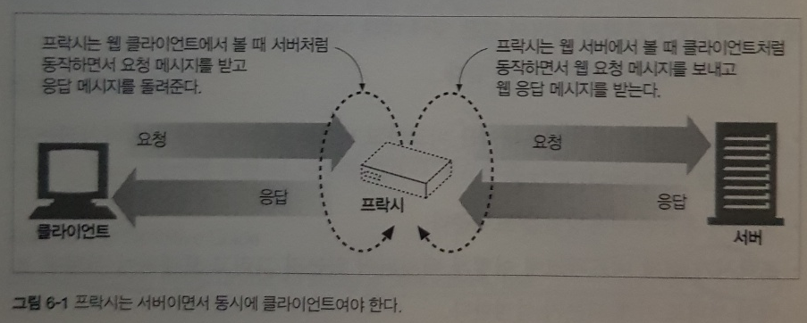
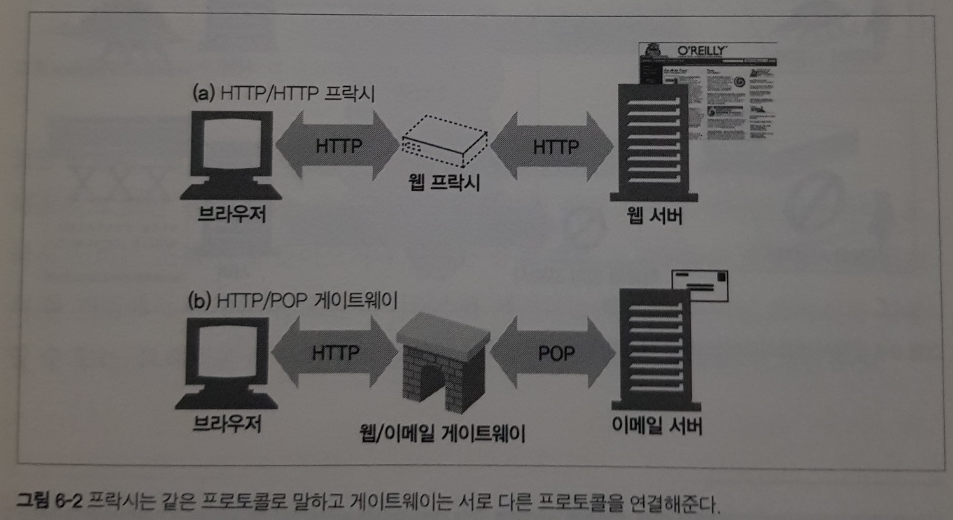
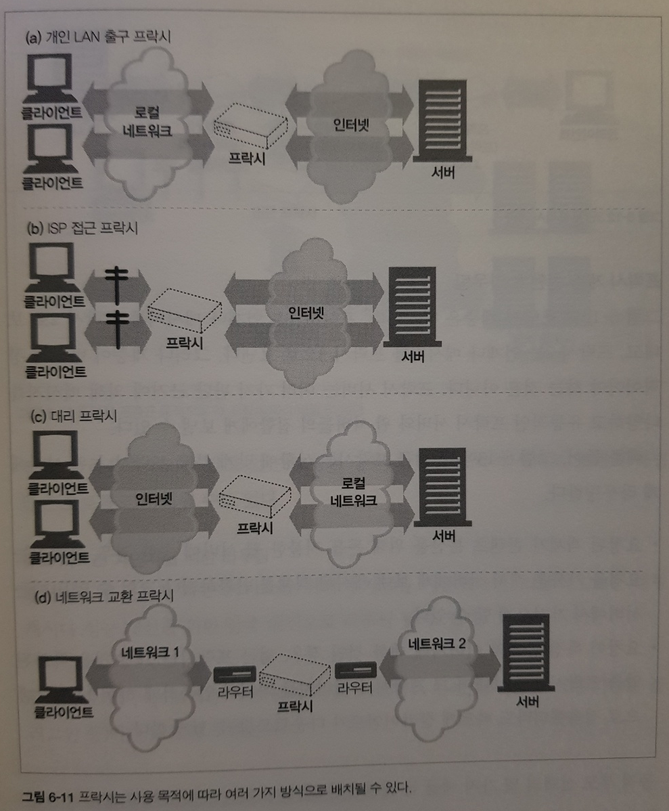
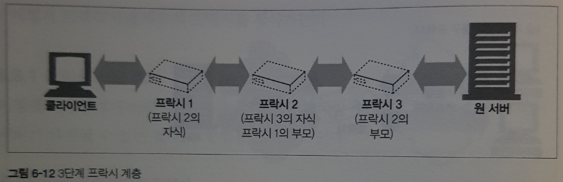
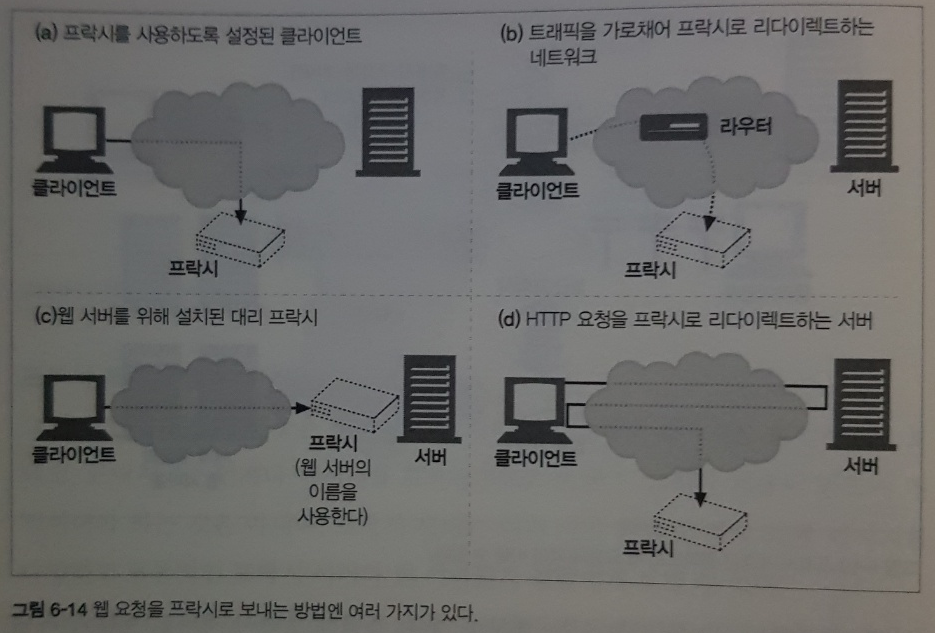
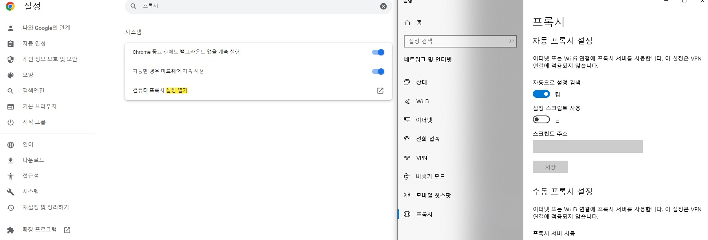
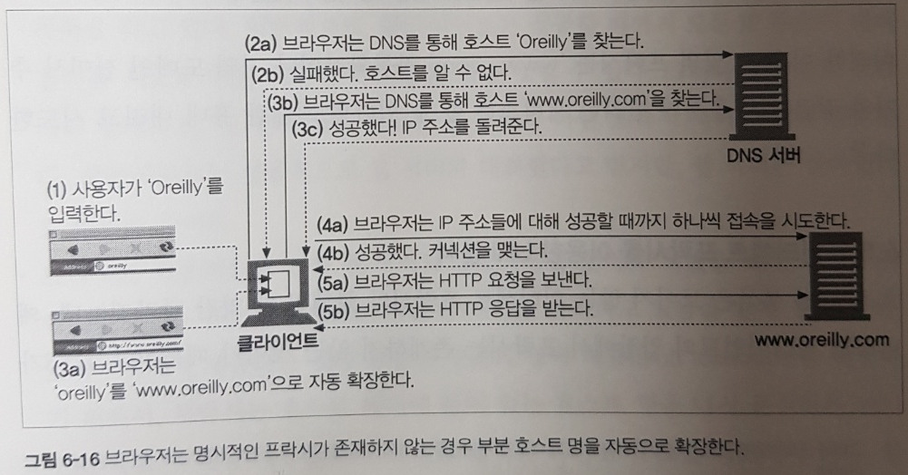
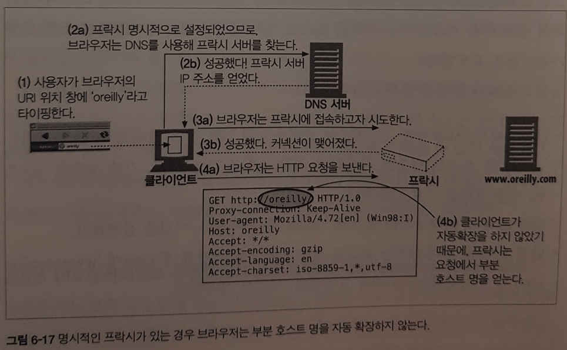

# 요약정리

- 교재중심의 요약정리를 목표로 합니다. (+ 개인적 견해)

### 6.1 웹 중개자

- 프락시는 서버이면서 동시에 클라이언트이다.
  
  

### 6.1.1 개인 프락시와 공유 프락시

- 공용 프락시: 여러 클라이언트가 함께 사용하는 프락시이며, 공통된 요청이라는 효율이라는 부분에서 대부분의 프락시는 공용 프락시이다.
- 개인 프락시: 하나의 클라이언트만을 위한 프락시.  보통은 클라이언트 컴퓨터에서 직접 실행되는 형태로 사용된다.

### 6.1.2 프락시 대 게이트웨이

- 프락시: 같은 프로토콜을 사용하는 둘 이상의 애플리케이션을 연결
- 게이트웨이: 서로 다른 프로토콜을 사용하는 둘 이상을 연결
- 그러나 현실은 모호하다. why? 프락시가 프로토콜 변환하는 기능을 가지기도하고 웹 기반 애플리케이션을 지원하기 위해 게이트웨이 기능을 구현한다.
- 자세한 내용은 8장 게이트웨이에서 다루어 봅시다.
  
  

### 6.2 왜 프락시를 사용하는가?

- 프락시는 실용적이고 유용적이다!
- 기능: 보안개선, 성능상승, 비용절약, HTTP 트래픽 감시 및 수정을 통해 웹 서비스 구현가능
- 예시: 어린이 필터, 문서 접근 제어자(권한 부여), 보안 방화벽, 웹 캐시(로컬 사본관리-> 비용절약), 대리 프락시(=서버가속기 -> 성능향상)
- 예시: 콘텐츠 라우터, 트랜스코더(파일 확장자 변경-> 용량 감소), 익명화 프락시(익명성 강화)

### 6.3 프락시는 어디에 있는가?

- 목표1: 어떻게 프락시가 네트워크에 배치되는가?
- 목표2: 어떻게 프락시의 연쇄가 계층을 이루는가?
- 목표3: 어떻게 트래픽이 올바르게 프락시를 찾아가는가?

### 6.3.1 프락시 서버 배치(목표1)



(a) 출구 프락시

- 위치: 로컬 네트워크 출구
- 목적: 방화벽, 요금절약, 트래픽 성능개선

(b) 접근 프락시

- 위치: ISP 접근 지점
- 목적: ISP는 사용자들의 다운로드 속도를 개선하고 비용절감을 목적으로 캐시 프락시를 사용해 자주 찾는 문서들의 사본을 저장

(c) 대리 프락시

- 위치: 네트워크의 가장 끝에 있는 웹 서버들의 바로 앞에 위치
- 목적: 웹 서버로 향하는 모든 요청을 처리하고 필요할 때만 웹서버에게 자원을 요청, 웹 서버 이름과 IP주소로 스스로를 가장

(d) 네트워크 교환 프락시

- 위치: 네트워크 사이의 인터넷 피어링 교환 지점들
- 목적: 캐시를 이용해 인터넷 교차로의 혼잡을 완화하고 트래픽의 흐름을 감시
- 보통은 인터넷 대역폭이 매우 비싼 곳에 배치.

### 6.3.2 프락시 계층(목표2)



- 프락시 계층: 부모와 자식으로 연쇄를 이루는 구성
- 인바운드 프락시(서버에 가까운쪽), 아웃바운드 프락시(클라이언트에 가까운쪽)
- 위의 그림은 정적이지만 동적으로 자식 프락시가 상황에 맞게 부모나 서버에 라우팅 합니다.
- 예시
  - 부하 균형: 부모 프락시의 부하 상태에따라 부모를 선택
  - 지리적 인접성에 근거한 라우팅: 서버의 지역을 담당하는 부모 선택
  - 프로토콜/ 타입 라우팅: URI에 근거하여 부모 혹은 서버로 라우팅
  - 유료 서비스 가입자를 위한 라우팅: 압축 엔진(고성능 서비스)으로 라우팅

### 6.3.3 어떻게 프락시가  트래픽을 처리하는가?(목표3)



- 우선 보통 서버는 클라이언트와 직접 대화하기 때문에, 클라이언트의 트래픽이 프락시로 가도록 만들어야 한다
  
  
  
  (a) 클라이언트를 수정한다.
- 클라이언트가 프락시를 사용하도록 설정하면 서버가 아닌 프락시로 보낸다.

        (b) 네트워크를 수정한다.

- 인터셉트 프락시: 스위칭, 라우팅 장치를 사용해서 익명의 클라이언트의 트래픽을 네트워크 인프라 전체 가로채서 프락시로 보낸다.

        (c) DNS 이름공간을 수정한다.

- 대리 프락시의 특징(서버의 이름, IP주소를 사용)을 활용한다. 수동으로 DNS 이름 테이블을 수정하거나 자동으로 처리해주는 동적 DNS 서버를 이용해서 조정

        (d) 웹 서버를 수정한다.

- 웹 서버가 리다이렉션 명령(305코드)으로 프락시로 보낼 수 있다.

### 6.4 클라이언트 프락시 설정

- 모든 브라우저는 프락시를 사용할 수 있다.
- 수동 설정: 명시적으로 설정
- 브라우저 기본 설정: 브라우저 배포자가 브라우저를 사용자에게 전달하기 전에 프락시를 미리 설정.
- 프락시 자동 설정(PAC): 프락시 사용에 관한 자바스크립트(=자바스크립트 프락시 자동 설정 파일)를 설정하여 자동으로 실행한다.
- WPAD 프락시 발견: 대부분의 브라우저는 자동설정 파일을 다운받을 수 있는 '설정 서버'를 자동으로 찾아주는, 웹 프락시 자동발견 프로토콜(WPAD)을 제공한다. -> 적절한 PAC를 자동으로 찾아서 실행한다.

### 6.4.1 클라이언트 프락시 설정: 수동



- 프락시의 호스트와 포트를 지정하여 프락시를 수동으로 설정한다.
- 단 하나의 프락시 서버만 지정 가능
- 장애 발생시 대처 어려움

### 6.4.2 클라이언트 프락시 설정: PAC 파일

- 장애 발생시 상황에 맞게 계산하여 적절한 프락시 서버로 변경한다.
- PAC파일: 자바스크립트 PAC파일의 URI를 부라우저에 설정해야 한다.

### 6.4.3 클라이언트 프락시 설정: WPAD

- 브라우저에게 알맞는 PAC파일을 자동으로 찾아주는 알고리즘
- 클라이언트 입장: PAC URI를 찾기위해 WPAD사용 -> PAC 가져옴 -> PAC 실행 -> 프락시 서버 요청
- WAPD 명세: 동적 호스트 발견 규약, 서비스 위치 규약, DNS 잘 알려진 호스트 명, DNS SRV 레코드, DNS TXT 레코드 안의 서비스 URI

### 6.5 프락시 요청의 미묘한 특징들

- 프락시 요청의 URI는 서버 요청과 어떻게 다른가?
- 인터셉트 프락시와 리버스 프락시는 어떻게 서버 호스트 정보를 알아내기 어렵게 만드는가?
- URI 수정에 대한 규칙
- 프락시는 브라우저의 똑똑한 URI 자동완성이나 호스트 명 촥장 기능에 어떻게 영향을 주는가?

### 6.5.1 프락시 URI는 서버 URI와 다르다.

- 웹 서버와 웹 프락시 메시지의 문법은 서로 같지만, 클라이언트가 프락시 대신 서버로 요청을 보내면 요청의 URI가 달라진다.
- 만약 서버로 보낸다면, /index.html 이지만 프락시로 보낸다면, http://www.naver.com/index.html 으로 완전한 URI으로 보낸다.
- why? 예전에는 프락시, 가상호스팅이 없어서 부분만 보내도 상관 없었지만 지금은 완전한 URI를 보내야 한다.
- 그래서 명시적으로 프락시 사용을 설정한다면 완전한 URI로 보내야한다.

### 6.5.2 가상 호스팅에서 일어나는 같은 문제

- 문제: 스킴, 호스트, 포트번호 누락
- 프락시: 명시적 설정으로 완전한 URI 요청
- 가상 호스팅: HOST 헤더로 누락된 정보를 요청

### 6.5.3 인터셉트 프락시는 부분 URI를 받는다.

- 명시적 설정으로 문제를 해결했지만, 추가적인 문제가 있다.
- 추가적인 문제: 클라이언트는 자신이 프락시와 대화하고 있음을 항상 알고 있지 않음.
- 이에 부분 URI를 받는 경우가 2가지 존재한다.
- 대리 프락시: 서버의 이름과 IP주소를 그대로 받기 때문에 부분 URI를 받는다.
- 인터셉트 프락시: 서버로 가는 중간에 가로 채는것이기 때문에 부분 URI를 받는다.

### 6.5.4 프락시는 프락시 요청과 서버 요청을 모두 다룰 수 있다.

- 프락시는 애초에 프락시로 오는 경우와 서버에서 리다이렉트로 올 수 있기 때문에 프락시 요청과 서버 요청을 모두 다룰 수 있다.
- 또한, 위에 언급한 경우에 따라 완전한 URI, 부분 URI 모두를 사용한다.
- 사용 규칙
  - 완전한 URI가 주어진다면, 프락시는 그것을 사용한다.
  - 부분 URI가 주어지고 Host 헤더가 있다면 Host 헤더를 사용하여 서버의 이름과 포트번호를 얻는다.
  - 부분 URI가 주어지고 Host 헤더가 없다면 다른 방법으로 서버의 이름과 포트번호를 얻는다.
    - 대리 프락시: 실제 서버의 주소와 포트 번호가 이미 설정되어있다.
    - 인터셉트 프락시: 이전에 다른 인터셉트 프락시가 사용했고 해당 인터셉트 프락시가 서버의 이름과 포트번호를 제공한다면 얻는다.
    - 그외에는 실패 에러 메시지를 반환한다.

### 6.5.5 전송 중 URI변경

- 몇몇 프락시는 URI를 변경하기도 하는데 상호운용성 문제때문에 URI 변경에 매우 신경을 쓴다.

### 6.5.6 URI 클라이언트 자동확장과 호스트 명 분석




- 브라우저는 프락시의 존재 여부에 따라 요청 URI를 다르게 분석한다.
- 프락시가 없다면, URI그대로 대응 IP주소를 찾는다.

### 6.5.7 프락시 없는 URI 분석

- 프락시 없는 브라우저 호스트 명 자동확장

### 6.5.8 명시적 프락시 URI 분석



- 명시적 프락시 사용시, 자동확장을 사용하지 않는다.

### 6.5.9 인터셉트 프락시를 이용한 URI 분석

- 기본적으로 프락시 없는 URI 분석과 동일하다. 그러나 잘못된 IP주소 혹은 죽은 IP주소에 대한 접속 시도는 프락시에서 정리된다.

### 6.6 메시지 추척

- 요즘엔 2개 이상의 프락시를 지나는게 흔하다.
- 클라이언트는 ISP 프락시를 통해서 웹 서버로 접근하려하지만 성능 개선과 비용 절감을 위해서 캐시 프락시를 추가로 설치한다.
- 클라이언트 - ISP 프락시 - 캐시 프락시 - 웹 서버
- 뿐만 아니라 다른 스위치와 라우터를 넘나들면서 IP 패킷의 흐름을 추척하는것 또한 복잡해진다.

### 6.6.1 Via 헤더

- Via 헤더 필드는 메시지가 지나는 각 중간 노드(프락시나 게이트웨이)의 정보를 나열.
- 목적: 메시지의 전달을 추적, 메시지 루프를 진단, 요청을 보내고 응답을 받는 과정에 관려하는 모든 메시지 발송자들의 프로토콜을 다루는 능력을 알아보기 위해 사용.
- 프락시는 요청을 보내기 전에 자신을 가리키는 유일한 문자열을 Via 헤더에 삽입해야하고 네트워크에 라우팅 루프가 있는지 탐지하기 위해 이 문자열이 들어온 요청에 있느지 검사.

```html
    Via: 1.1 proxy-62.irenes-isp.net, 1.0 cache.joes-hardware.com
```

- 구성: 프로토콜 이름(선택), 프로토콜 버전(필수), 노드 이름(중개자의 호스트와 포트번호), 노드 코멘트(선택)

- 보안: 호스트 명이 들어가길 원하지 않을 수있다. 그래서 적당한 가명으로 교체할 수 있고 일련의 경유지 항목들을 하나로 합칠 수 있다.

### 6.6.2 TRACE 메서드

- 프락시 서버는 메시지가 전달될 때 메시지를 바꿀 수 있다.
- TRACE 메서드는 요청 메시지가 프락시 연쇄를 따라가면서 어떤 프락시를 지나가고 변하는지 관찰, 추척할 수 있다.
- 메시지가 서버에 도착한다면, 해당 관찰 내용을 돌려 보낸다. 

### 6.7 프락시 인증

- 프락시는 접근 제어 장치로서 제공될 수 있다.

### 6.8 프락시 상호운용성

- 클라이언트, 서버, 프락시는 여러 버전에 의해 만들어 지고 각 기능을 지원하면서 서로 다른 버그를 가지고 있다.
- 이에 프락시는 서버와 클라이언트 사이에서 올바른 중개를 해야한다.

### 6.8.1 지원하지 않는 헤더와 메서드 다루기

- 프락시 서버는 넘어오는 헤더 필드를 이해 못할 수있다. 그럴 때는 그대로 전달한다.

### 6.8.2 OPIONS: 어떤 기능을 지원하는지 알아보기

- HTTP OPTIONS 메서드는 서버나 웹 서버의 특정 리소스가 어떤 기능을 지원하는지 클라이언트가 알아볼 수 있게 해준다.

### 6.8.3 Allow 헤더

- 요청 URI에 의해 식별되는 자원에 대해 지원되는 메서드들이나 서버가 지원하는 모든 메서드를 열거한다.
