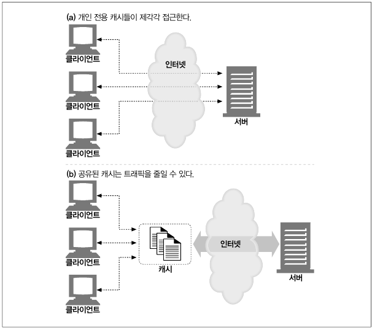
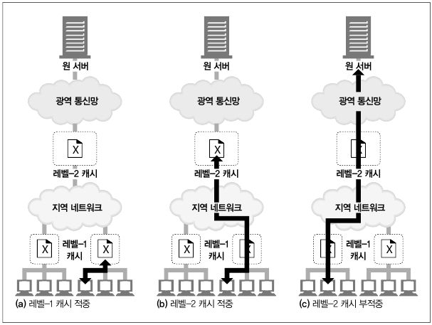
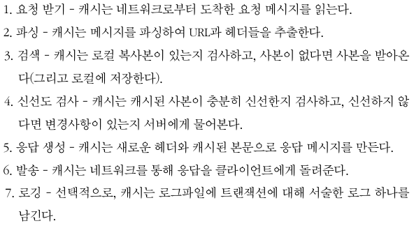
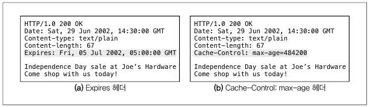

# 캐시

* 불필요한 데이터 전송
  
  * 자주 쓰이는 페이지를 계속 요청할 때, 똑같은 바이트들이 네트워크를 통해 반복 이동해서 전송을 느리게 하고, 웹 서버 부하를 줌
    
    * 첫 서버로부터의 응답을 캐시에 담아, 바로 쓸 수 있어서 해결 가능

* 대역폭 병목
  
  * 대역폭은 네트워크 속도와 문서 크기에 따라 전송 시간 영향을 받음
    
    * 클라이언트에서 서버에 접근할 때의 속도는 그 경로의 가장 느린 것과 같아서, 빠른 네트워크를 가진 캐시로부터 받아오면 성능 대폭 개선

* 갑작스런 요청 쇄도
  
  * 갑작스런 사건으로 많은 사람들이 동시에 웹 문서에 접근할 때, 트래픽 급증과 네트워크와 웹 서버의 심각한 장애 야기
    
    * 각각의 캐시로 분산해결(?)

* 거리로 인한 지연
  
  * 빛의 속도로 보내도, 이것 또한 커넥션이 많아지면 유의미한 지연 유발
    
    * 바로 옆에 캐시를 위치시켜 해결

* 적중과 부적중
  
  * 적중 : 요청에 대응하는 사본이 있을 때, 캐시에서 바로 건내줌
  
  * 부적중 : 요청에 대응하는 사본이 없을 때, 서버로 객체 받아옴
  
  * 재검사 적중 or 느린 적중 : 작은 데이터의 재검사 요청을 보내, 변경사항 없으면 HTTP 304 Not Modified 응답 포함
    
    * if-Modified-Since 헤더 : 재검사로 많이 쓰이는 헤더 -> 캐시된 시간과 비교함
  
  * 재검사 부적중 : 변경사항 있으면 서버로 객체 받아옴, HTTP 200 OK 응답 포함
  
  * 객체 삭제 : 객체가 삭제되어있으면, 404 Not Found 응답과 캐시의 사본 삭제
  
  * 문서 적중률과 바이트 적중률
    
    * 문서 적중률(캐시 적중률) : 0 ~ 1 or 0% ~ 100%
      
      * 요청 시 캐시에서 가져오는 비율
    
    * 바이트 적중률
      
      * 문서마다 바이트가 달라 전체 트래픽에 기여도가 다르므로, 바이트로 적중률 계산

* 캐시 토폴로지
  
  * 개인 전용 캐시
    
    * 웹브라우저가 개인 전용 캐시 내장하고 있고, 자주 쓰는거 디스크와 메모리에 캐시 해준다. 또한, 사용자가 캐시 사이즈와 설정을 수정할 수 있게 해줌
  
  * 공용 프락시 캐시
    
    
  
  * 프락시 캐시 계층들
    
    

* 캐시 처리 단계
  
  

* 사본을 신선하게 유지하기
  
  * 유효기간과 나이
    
    
  
  * 조건부 메서드와의 재검사
    
    * If-Modified-Since (캐시된 마지막 수정일)
      
      * Last-Modified 헤더와 비교해서 날짜 다르면 갱신
    
    * if-None-Match
      
      * Etag 확인해서 다를 때만 갱신
      
      * 변경 날짜 다르지만, 같은 내용일 수 있기 때문에 사용
      
      * 주석같은 사소한 것들을 무시할 수 있어서 사용
      
      * 어떤 서버들은 최근 변경 일시를 판별 못해서 사용
      
      * 1초 같이 짧은 간격으로 변경되는 문서는 서버들이 판단하기 힘들어 사용
  
  * 약한 검사기와 강한 검사기
    
    * 약한 검사기 : 내용이 변했지만, 중요하지 않고 무시할 수 있는 경우
      
      * 서버에서 'W/' 접두사를 Etag 에 부착해서 구분
    
    * 강한 검사기 : 중요 내용 변했을 때
      
      * Etag 다르면 갱신
  
  * 언제 Etag를 사용하고, 언제 Last-Modified 사용할까
    
    * 서버에서 무엇을 반환해주냐에 따라 다름

* 캐시 제어
  
  * Cache-Control: no-store
    
    * 응답의 사본을 만드는 것 금지시킨다
  
  * Cache-Control: no-cache
    
    * 재검사 없이는 캐시에서 클라이언트로 제공될 수 없다
  
  * Cache-Control: mush-revalidate
    
    * 신선하지 않을 때, 최초의 재검사 후 사용 가능하다
  
  * 휴리스틱 만료
    
    * Cache-Control: max-age 나 Expires 헤더를 포함하지 않았을 때 경험적인 방법으로 최대 나이 계산한다
    
    * LM 인자 알고리즘 : 문서의 최근 변경 일시 정보가 있다면 보고 최대 나이 계산
    
    * 최근 변경 일시 정보가 없으면 기본 값을 설정해준다

* 자세한 알고리즘
  
  * 나이와 신선도 수명
    
    * 기량 부족,,

* 캐시와 광고
  
  * 광고 회사의 딜레마
    
    * 원 서버로 HTTP가 접을 하지 않고, 캐시로 접근한다. 근데 캐시는 그 조회수를 숨길 수 있다. 조회수로 돈을 버는 광고회사는 계산하지 못하기에 딜레마
      
      * '캐시 무력화'로 해결
      
      * 여러 방법 중 하나는 모든 접근에 원 서버에 재검사 강제로 실시
