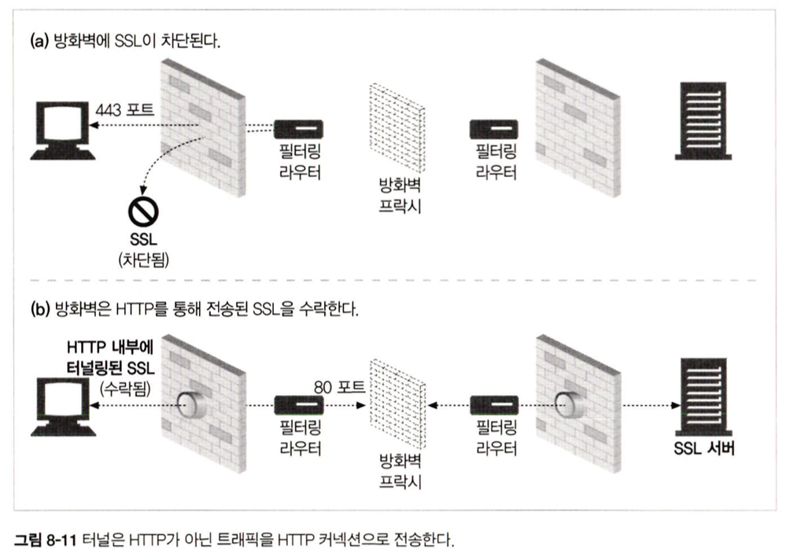

# 8장 통합점 : 게이트웨이, 터널, 릴레이

## 목차
 ### 8.1. 게이트웨이
 ### 8.2. 프로토콜 게이트웨이
 ### 8.3. 리소스 게이트웨이
 ### 8.4. 애플리케이션 인터페이스와 웹 서비스
 ### 8.5 터널
 ### 8.6 릴레이


## 8.1. 게이트웨이
- 복잡한 리소스들을 한 개의 어플리케이션으로만 처리할 수 없다는 문제를 해결하기 위해 만들었다.
- 리소스와 애플리케이션을 연결하는 역할을 한다.
- 요청을 받고 응답을 보내는 포털 같이 동작하는데, 동적인 콘텐츠를 생성하거나 데이터베이스에 질의를 보낼 수 있다. 
- HTTP 트래픽을 다른 프로토콜로 자동으로 변환하여, HTTP 클라이언트가 다른 프로토콜을 알 필요 없이 서버에 접속할 수 있게 한다.

## 8.2 프로토콜 게이트웨이
- 일반적인 브라우저는 서버에 HTTP 트래픽을 바로 보낸다.
- 브라우저에 명시적으로 게이트웨이를 설정하여 자연스럽게 트래픽이 게이트웨이를 거쳐가게 하거나, 게이트웨이를 대리 서버로 설정할 수 있다.


## 8.3 리소스 게이트웨이
- 일반적으로 애플리케이션 서버는 목적지 서버와 게이트웨이를 한 개의 서버로 결합한다.

  ### 8.3.1 공용 게이트웨이 인터페이스 
  - 공용 게이트웨이 인터페이스(CGI)는 최초의 서버 확장이자 지금까지도 가장 널리 쓰이는 서버 확장이다.
  - CGI 애플리케이션이 서버와 분리되면서 다양한 언어로 구현되며, 거의 모든 HTTP서버가 지원한다.
  - CGI가 내부에서 어떤 처리를 하는지 사용자에게 보이지 않고, 내부적으로 일반적인 요청을 만든다.

  ### 8.3.2 서버확장 API
  - 서버 개발자는 웹 개발자가 자신의 모듈을 HTTP와 직접 연결할 수 있는 강력한 인터페이스인 서버 확장 API를 제공한다.
  - 확장 API는 프로그래머가 자신의 코드를 서버에 연결하거나 서버의 컴포넌트를 자신이 만든 것으로 교체해버릴 수 있게 한다. 

## 8.4 애플리케이션 인터페이스와 웹 서비스
- 애플리케이션을 연결하면서 데이터를 교환하려는 두 어플리케이션 사이에서 프로토콜 인터페이스를 맞추는 일은 까다롭다.
- 웹 애플리케이션이 서로 통신하는데 사용할 표준과 프로토콜 집합을 개발
- 웹 서비스는 SOAP을 통해 XML을 사용하여 정보를 교환한다.

## 8.5 터널
- HTTP 프로토콜을 지원하지 않는 애플리케이션에 HTTP 애플리케이션을 사용해 접근하는 방법을 제공한다.
- HTTP 커넥션을 통해서 HTTP가 아닌 트래픽을 전송할 수 있고, 다른 프로토콜을 HTTP 위에 올릴 수 있다.
- 주로 HTTP 커넥션 안에 HTTP가 아닌 트래픽을 얹기 위해서 사용한다.

  ### 8.5.1 CONNECT로 HTTP 터널 커넥션 맺기
    - 웹 터널은 HTTP의 CONNECT 메서드를 사용해 커넥션을 맺는다.
    - CONNECT 메서드는 터널 게이트웨이가 임의의 목적 서버와 포트에 TCP 커넥션을 맺고 클라이언트와 서버 간에 오는 데이터를 무조건 전달하기를 요청한다.

  - CONNECT 요청
    - 시작줄을 제외하고는 HTTP 메서드와 같다.
    ```
    CONNECT home.netscape.com:443 HTTP/1.0
    User-agent : Mozilla/4.0
    ```
    - 추가적인 요청 헤더필드가 있거나 없고, 각 행은 CRLF로 끝난다.

  - CONNECT 응답
    - 클라이언트는 요청을 전송한 다음, 게이트웨이의 응답을 기다린다.
    - 커넥션이 메시지를 전달하는 대신 바이트를 그대로 전달하기 때문에 콘텐츠의 형식을 기술하는 Content-Type 헤더를 포함할 필요가 없다.
    ```
    HTTP/1.0 200 Connection Established
    Proxy-agent : Netscape-Proxy/1.1
    ```
  ### 8.5.2 데이터 터널링, 시간, 커넥션 관리
    - 터널을 통해 전달되는 데이터는 게이트웨이에서 볼 수 없어서 패킷의 순서나 흐름에 대한 어떤 가정도 할 수 없다.
    - 클라이언트는 성능을 높이기 위해 CONNECT 요청을 보낸 후, 응답을 받기 전에 터널데이터를 전송할 수 있다.
    - 게이트웨이는 커넥션이 맺어지는 대로 헤더를 포함해서 읽어들인 모든 데이터를 서버에 전송해야 한다.
    - 요청 후에 터널을 통해 데이터를 전송한 클라이언트는 인증요구나 200외의 응답이 올 때, 다시 보낼 준비가 되어있어야 한다.
    - 터널의 어느 부분이든 커넥션이 끊어지면 반대편도 프락시에 의해 끊어진다.

  ### 8.5.3 SSL 터널링
    - 웹 터널은 원래 방화벽을 통해서 암호화된 SSL 트래픽을 전달하기 위해 개발되었다.
    - 많은 회사가 더 강력한 보안을 위해 모든 트래픽이 패킷을 필터링하는 라우터와 프락시를 지나도록 하였지만, SSL 같은 암호화된 프로토콜은 정보가 암호화되어 있기에 낡은 방식의 프락시에서는 처리되지 않는다.
    - 터널을 사용하면 SSL 트래픽을 HTTP 커넥션으로 전송하여 80포트의 HTTP만을 허용하는 방화벽을 통과시킬 수 있다.
    

  ### 8.5.4 SSL터널링 vs HTTP/HTTPS 게이트웨이
    - HTTP 프로토콜은 다른 프로토콜과 같은 방식으로 게이트웨이를 통과할 수 있다.
    - 원격 HTTPS 서버와 SSL 세션을 시작하는 게이트웨이를 두고 클라이언트 측의 HTTPS 트랜잭션 수행하지만 몇 가지 단점이 있다.
    - HTTP 프로토콜 단점
      - 클라이언트-게이트웨이 사이에는 보안이 적용되지 않은 일반 HTTP 커넥션이 맺어져 있다.
      - 프락시가 인증을 담당하고 있기 때문에 클라이언트는 원격 서버에 SSL 클라이언트 인증(X509 인증서 기반 인증)을 할 수 없다.
      - 게이트웨이는 SSL을 완벽히 지원해야 한다.
  ### 8.5.5 - 8.5.6 터널인증 및 터널 보안에 대한 고려사항들
    - 터널인증
      - 프락시 인증 기능은, 클라이언트가 터널을 사용할 수 있는 권한을 검사하는 용도로 터널에서 사용 할 수 있다.
    - 고려사항
      - 터널 게이트웨이는 통신하고 있는 프로토콜이 터널을 올바르게 사용하고 있는지 검증할 방법이 없다.
      - 터널의 오용을 최소화하기 위해, 게이트웨이는 HTTPS 전용 포트인 443 같이 잘 알려진 특정 포트만을 터널링 할 수 있도록 해야 한다.

  


## 8.6 릴레이
- HTTP 릴레이는 HTTP 명세를 완전히 준수하지 않는 간단한 HTTP 프락시
- 맹목적으로 트래픽을 전달하는 간단한 프락시
- 간단한 프락시 구현이기에 단순 필터링이나 진단 혹은 콘텐츠 변환을 하는데 사용되기도 한다.
- 문제점
  - 맹목적 릴레이가 Connection 헤더를 제대로 처리하지 못해서 keep-alive 커넥션 행에 걸린다. 
  - 릴레이가 HTTP 요청을 받아도, Connection 헤더를 이해하지 못하므로 단순히 요청을 서버로 넘기고, 이에 넘겨진 HTTP 요청은 웹 서버에 도착해 Connection:Keep-Alive 헤더를 전달하고, 릴레이가 keep-Alive하기를 바란다고 잘못된 결론을 내린다.
  - 이를 서버는 클라이언트에 전달하고, 클라이언트는 헤더가 Keep-Alive를 동의한다고 추측하여 계속된 커넥션(hang)을 맺고있게 된다. 
  - 이에 아무 작업도 되고있지 않지만 브라우저는 계속 돌게되는 상태가 된다.
  
    
- 특정 목적을 위해 단순한 HTTP 릴레이를 구축하는 중이라면 그것을 어떻게 사용해야 할지 신중하게 고민해봐야 한다.

## 8.7 추가 정보
- http://www.w3.org/Protocols/rfc2616/rfc2616.txt
- Web Proxy Server


