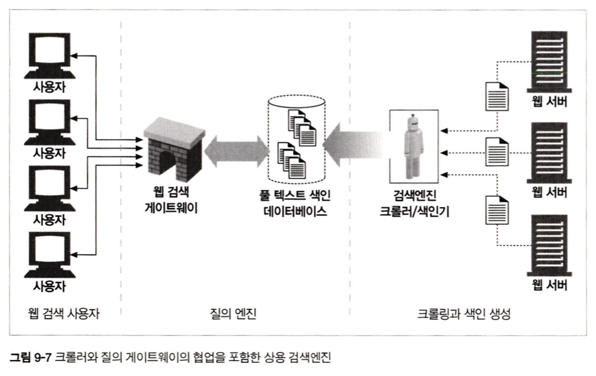
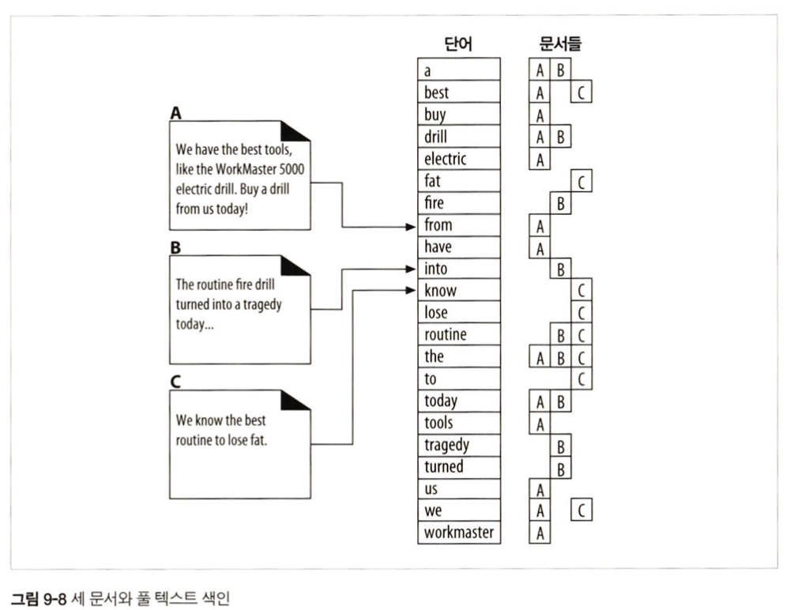

# 9장 웹 로봇

웹 로봇: 사람과의 상호작용 없이 연속된 웹 트랜잭션들을 자동으로 수행하는 소프트웨어

- 크롤러, 스파이더, 웜, 봇 등 각양각색의 이름으로 불림

## 9.1 크롤러와 크롤링

크롤러: 웹페이지 내의 모든 웹페이지를 가져오는 재귀적인 방식으로 웹을 순회하는 로봇

1. 루트 집합 - 대부분의 웹을 커버하기 위한 초기 출발 지점

2. 링크 추출과 상대 링크 정상화 - 상대 링크를 절대 링크로 변환하며 목록 확장

3. 순환 피하기 - 방문 목록이 필요

4. 루프와 중복 - 기능 마비, 웹 서버의 부담, 중복페이지로 인한 기능 저하 

5. 속도와 메모리 관리
   
   - 검색 트리 / 해시 테이블 사용 - 빠르게 방문한 URL 추적
   
   - 존재 비트 배열 (느슨한 자료 구조) 사용 - 해당 URL에 대응되는 존재 비트 생성
   
   - 체크 포인트 - 갑작스런 중단에 대비한 URL 방문 목록 저장
   
   - 파티셔닝 - 여러 로봇들이 URL의 한 부분에 할당되어 크롤링 / 로봇 간 협력 존재

6. 별칭(alias)과 로봇 순환 - 서로 다른 URL이 같은 문서를 가리킬 수 있음

7. URL 정규화 - 별칭을 가지는 URL을 표준 형식으로 변환
   
   - ex1. 포트 번호 추가, 이스케이핑 문자 변환, #태그 제거
   
   - ex2. 대소문자 구분, 색인 페이지 구분, 가상 호스팅 구분 - 웹 서버의 정보 필요

8. 파일 시스템 링크 순환 
   
   - html과 같은 형식에서 상대 경로(심벌릭 링크)를 이미 방문한 URL로 인식하기 어려움
   
   - ex. /subdir/images/subdir/images/subdir/images...

9. 동적 가상 웹 공간
   
   - 의도적으로 크롤러를 루프에 빠뜨리는 게이트웨이 어플리케이션
   
   - 혹은 달력 프로그램과 같이 의도하지 않아도 일어날 수 있음

10. 루프와 중복 피하기 - 유효 컨텐츠의 손실 동반
    
    - URL 정규화
    
    - 너비 우선 크롤링 - 순환의 영향 최소화 / 웹 서버 부담 완화
    
    - 스로틀링 - 일정 시간 동안 가져오는 페이지의 숫자 제한
    
    - URL 크기 제한 - 일정 크기 (보통 1KB)를 넘는 URL 크롤링 거부 / 서비스 거부 공격자로 오해할 수 있음
    
    - URL/사이트 블랙 리스트 
    
    - 패턴 발견 - 파일 시스템의 심벌릭 링크를 통한 순환의 패턴을 감지
    
    - 콘텐츠 지문(fingerprint)
      
      - 콘텐츠에서 몇 바이트로 체크섬(checksum) 계산
      
      - 동일 체크섬을 가진 페이지는 크롤링하지 않음
    
    - 사람의 모니터링 - 진단과 로깅이 동반되어야함

## 9.2 로봇의 HTTP

로봇도 적절한 HTTP 요청 헤더를 사용해야함

1. 요청 헤더 식별하기 - 신원 식별 헤더 구현 및 전송
   
   - User Agent; 서버에게 요청을 만든 로봇의 이름을 제공
   - From; 로봇의 사용자/관리자의 이메일 주소를 제공
   - Accept; 서버에게 어떤 미디어 타입을 보내도 되는지 제공
   - Referer; 현재의 요청 URL 을 포함한 문서의 URL을 제공

2. 가상 호스팅 - Host 헤더를 포함 해야 여러 사이트를 운영하는 서버에서 적절한 콘텐츠를 얻을 수 있음

3. 조건부 요청 - 시간이나 엔터티 태그를 비교하여 콘텐츠가 변경(버전이 업데이트)되었을 때만 HTTP 요청을 구현

4. 응답 다루기 - 일반적으로 대다수의 로봇은 GET 메소드, 그러나 서버와 상호작용하는 로봇도 존재
   
   - 상태 코드 - 서버가 반환하는 상태 코드를 인식하여 작동
   
   - 엔터티 - HTTP 헤더에 임베딩된 정보를 따라 엔터티 자체의 정보를 확인

5. User-Agent 타게팅 - 사이트 관리자들이 로봇의 요청을 다루기 위한 전략

## 9.3 부적절하게 동작하는 로봇들

- 폭주하는 로봇: 많은 HTTP 요청을 통하여 웹 서버의 극심한 부하를 주는 로봇

- 오래된 URL: 존재하지 않는 URL에 요청을 보내 웹 서버 요청 수용 능력을 감소시킴

- 길고 잘못된 URL: 웹 서버의 처리 능력에 영향을 주고 접근 로그를 어지럽힘

- 호기심이 지나친 로봇: 하이퍼링크가 존재하지 않는 디렉터리의 콘텐츠를 가져오는 로봇

- 동적 게이트웨이 접근: 게이트웨이 어플리케이션의 콘텐츠를 요청

## 9.4 로봇 차단하기

Robots Exclusion Standard / robots.txt 를 통하여 서버의 접근 가능한 부분의 정보 제공

1. 로봇 차단 표준
   
   | 버전  | 이름과 설명                                                 | 날짜      |
   | --- | ------------------------------------------------------ | ------- |
   | 0.0 | 로봇 배제 표준 지시자를 지원하는 마틴 코스터의 오리지널 robots.txt 메커니즘        | 1994.06 |
   | 1.0 | 웹 로봇 제어 방법 지시자의 지원이 추가된 마틴 코스터의 IETF 초안                | 1996.11 |
   | 2.0 | 로봇 차단을 위한 확장 표준 정규식과 타이밍 정보를 포함한 숀 코너의 확장 (널리 지원되지 않음) | 1996.11 |

2. 웹 사이트와 robots.txt
   
   하나의 사이트에 하나의 robots.txt가 존재할 수 있음
   
   - robots.txt 가져오기 - robots.txt가 존재한다면 해당 파일을 text/plain으로 반환
   
   - 응답 코드 (HTTP)
     
     - 200대의 응답이 오면 콘텐츠를 파싱하여 규칙을 얻고 해당 규칙을 따름
     
     - 404면 robot.txt가 존재하지 않고 제약 없이 사이트에 접근
     
     - 접근제한(401 혹은 403)이면 해당 사이트에 접근이 제한됨
     
     - 요청 실패(503)라면 리소스 검색을 뒤로 미룸
     
     - 리다이렉션(3XX)이면 리소스가 발견될 때까지 해당 리다이렉트를 따라감

3. robots.txt 파일 포맷

```
# slurp과 webcrawler만이 사적인 하위 디렉터리를 제외한 모든 파일의 크롤링이 허락됨

User-Agent: slurp
User-Agent: webcrawler
Disallow: /private

User-Agent: *
Disallow: 
```

- User-Agent - 자신의 이름에 대응되거나 포함하는 레코드들 중 첫 번째를 찾음, 없다면 '*'인 레코드들 중 첫 번째를 찾음

- Disallow/Allow - 규칙 레코드를 시작하는 경로는 모두 해당된다. 이를 접두 매칭(prefix matching이라고 함)
4. 그 외에 알아둘 점
   
   - 다른 필드 포함 가능 / 로봇이 이해못하는 필드는 무시 가능
   
   - 한 줄에 하나의 레코드만
   
   - 주석은 어디든 허용
   
   - 0.0 버전은 Allow를 지원하지 않았음

5. robots.txt의 캐싱 만료 - HTTP 캐시 제어 메커니즘을 통해 robots.txt 파일을 관리
   
   - 로봇은 HTTP 응답의 Cache-Control과 Expires 헤더에 주의 기울여야함

6. 로봇 차단 펄 코드 - `272P X`

7. HTML 로봇 제어 META 태그
   
   `<META NAME="ROBOTS" CONTENT="[NOARCHIVE]">`
   
   - NOINDEX; 이 페이지를 처리하지 말고 무시
   - NOFOLLOW; 이 페이지가 링크한 페이지를 크롤링 제한
   - INDEX; 페이지 인덱싱 허용
   - FOLLOW; 링크한 페이지 크롤링 허용
   - NOARCHIVE; 페이지 캐시를 위한 로컬 사본을 만들면 안됨
   - ALL; INDEX, FOLLOW 와 같음
   - NONE; NOINDEX, NOFOLLOW 와 같음
   
   검색엔진 META 태그
   
   - DESCRIPTION; 웹 페이지의 짧은 요약을 정의
   
   - KEYWORDS; 키워드의 목록, 검색을 도움
   
   - REVISIT-AFTER; 지정한 날짜가 지난 이후 다시 방문해야 한다고 지시

## 9.5. 로봇 에티켓

1. 신원 식별
   
   - 로봇의 신원을 밝히라: User-Agent를 이용하여 웹 서버에게 로봇의 이름을 밝혀라
   
   - 기계의 신원을 밝혀라: DNS 엔트리를 가진 기계에서 실행된다는 것을 확실히 해서, 웹 사이트가 로봇의 IP 주소를 호스트 명을 통해 역방향 DNS를 할 수 있도록 해라
   
   - 연락처를 밝혀라: HTTP 폼 필드를 사용해서 연락할 수 있는 이메일 주소를 제공하라

2. 동작
   
   - 긴장하라: 로봇이 노련해지기 전까지는 운영자들을 고용해서 감시하라
   
   - 대비하라: 로봇이 여행을 떠나기 전에 조직에 사실을 알려둬라
   
   - 감시와 로그: 로봇이 정상적으로 동작하는지 진행상황을 추적하고 기본적인 검사가 가능하도록 진단과 로깅 기능을 풍부하게 갖춰야한다
   
   - 배우고 조정하라: 크롤링할 때마다 새로운 것을 배우게 된다. 로봇을 조정하고 개선하라

3. 스스로를 제한하라
   
   - URL을 필터링하라: 이해할 수 없거나 관심 없는 데이터를 참조하고 있다면 무시하는 것이 좋다
   
   - `동적 URL 을 필터링하라`: 보통 로봇은 동적인 게이트웨이로부터의 콘텐츠를 크롤링할 필요가 없다. URL이 'cgi'나 '?'를 포함하고 있다면 크롤링하지 않는 편이 나을 수 있다
   
   - Accept 관련 헤더로 필터링: HTTP accept 관련 헤더들을 이용하여 콘텐츠를 이해할 수 있는지 말해주어야 한다
   
   - robots.txt 에 따르라: 방문 웹 사이트의 robots.txt 를 따라야한다
   
   - 스스로를 억제하라: 한 사이트에 총 접근 횟수를 제한해야 한다

4. 루프와 중복을 견뎌내기, 그리고 그 외의 문제들
   
   - 모든 응답 코드 다루기: 모든 리다이렉트와 에러를 포함한 모든 HTTP 상태 코드를 다룰 수 있도록 준비되어 있어야한다
   
   - URL 정규화하기: 모든 URL을 표준화된 형식으로 변경하여 중복된 URL 을 제거하라
   
   - 적극적으로 순환 피하기: 순환을 감지하고 피하기위해 노력하라
   
   - 함정을 감시하라: 의도적이고 악의적인 순환을 피하기위해 함정을 감시하라
   
   - 블랙리스트를 관리하라: 함정, 깨진 사이트 등을 블랙리스트로 추가하고 다시는 방문하지 않도록 해라

5. `확장성`
   
   - 대역폭 이해하기: 얼마나 많은 네트워크 대역폭이 사용 가능한지, 요구되는 시간에 로봇 작업을 끝마치는데 얼마나 필요할지 이해하라
   
   - 시간 이해하기: 작업을 끝내는데 얼마나 많은 시간이 필요한지 이해하고, 소요된 시간이 추정한 것과 맞는지 간단히 검사해보라
   
   - 분할 정복: 대규모 크롤링을 하는 상황에서는 멀티프로세서 서버든 서로 협력하는 여러 개의 작은 컴퓨터 등 하드웨어들이 더 필요할 수 있다

6. 신뢰성
   
   - 철저하게 테스트하라: 풀어놓기 전 내부에서 철저하게 테스트하라
   
   - 체크포인트: 체크포인트/재시작 기능을 처음부터 설계하라
   
   - 실패에 대한 유연성: 실패에 대비하여 로봇을 실패가 발생했을 때도 계속 동작할 수 있도록 설계하라

7. 소통
   
   - 준비하라: 로봇에 대한 정책 안내 페이지를 만들고 robots.txt를 만드는 법에 대한 설명도 포함하라
   
   - 이해하라: 로봇 차단 규칙 표준에 대해 설명하고, 그래도 만족하지 못한다면 블랙리스트에 추가하라
   
   - 즉각 대응하라: 불만을 갖게 되는 요소에 대해서 즉각 대응하라

## 9.6 검색엔진

현대적인 검색엔진의 아키텍쳐



- 풀 텍스트 색인
  
  

- 게이트웨이 어플리케이션
  
  - 즉석에서 결과 페이지를 생성 후 반환
  
  - 관련도 랭킹(relevancy ranking): 검색 결과의 목록에 점수를 매기고 정렬하는 과정

- 스푸핑
  
  - 수 많은 키워드들을 나열한 가짜 페이지
  
  - 특정 단어에 대한 가짜 페이지 
