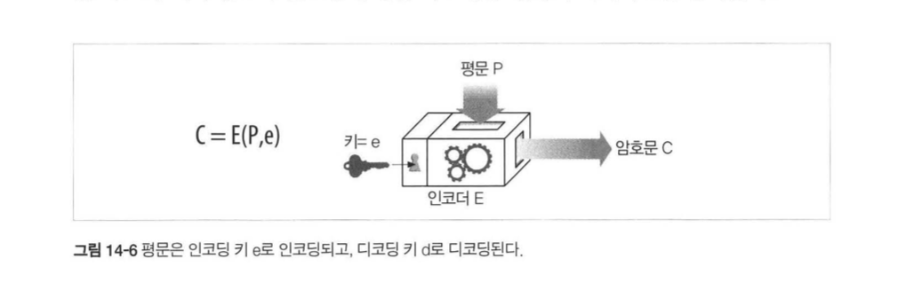
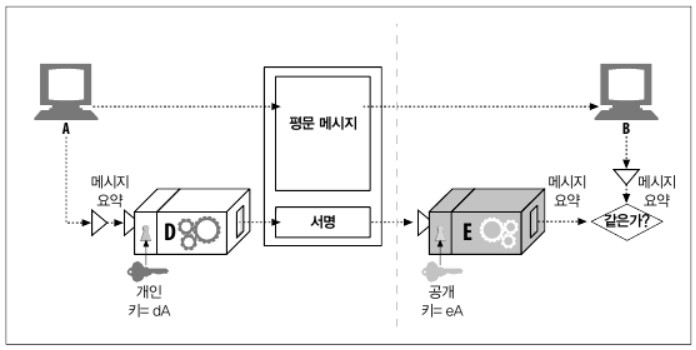
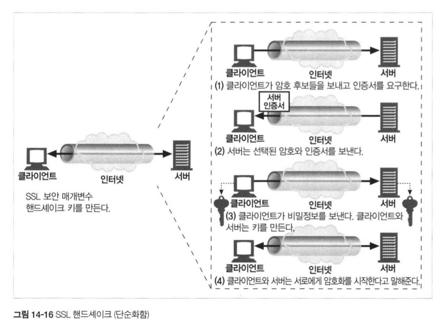

# 14장 보안 HTTP

## 14.1 HTTP를 안전하게 만들기

이전 장의 인증과 메시지 무결성과 비교하여 대량 구매, 은행 없무, 보안 자료 접근에 이용 되는 HTTP와 디지털 암호 기술의 결합

- HTTPS
  
  기존의 HTTP에서 TCP 계층과 HTTP 계층 사이에 SSL / TLS 계층이 존재
  
  - SSL (Secure Sockets Layer) - 안전 소켓 계층
  
  - TSL (Transport Layer Security) - 전송 계층 보안
    
    SSL 내의 라이브러리 안에서 작동하여 몇 가지 보안 정보 설정 및 관리만 추가하면됨

## 14.2 디지털 암호학

- 암호: 텍스트를 아무나 읽지 못하도록 인코딩하는 알고리즘
- 키: 암호의 동작을 변경하는 숫자로 된 매개변수
- 대칭키 암호 체계: 인코딩과 디코딩에 같은 키를 사용하는 알고리즘
- 비대칭키 암호 체계: 인코딩과 디코딩에 다른 키를 사용하는 알고리즘
- 공개키 암호법: 비밀 메시지를 전달하는 수백만 대의 컴퓨터를 쉽게 만들 수 있는 시스템
- 디지털 서명: 메시지가 위조 혹은 변조되지 않았음을 입증하는 체크섬
- 디지털 인증서: 신뢰할 만한 조직에 의해 서명되고 검증된 신원 확인 정보

## 14.3 대칭키 암호법

- 대표적으로 DES, Triple-DES, RC2, RC4 등이 존재

- 열거 공격 (Enumeration Attack)으로 키를 무차별 대입하여 코드를 크래킹 가능

- 작고 중요하지 않은 업무에서 40비트 키 (약 1조 가지)를 주로 사용 (2초 내로 크래킹)

- 128비트 키를 사용한 암호는 매우 강력한 것으로 간주 (10^18년)

- 사용자가 많아 각각의 개인 키를 발급하는 순간 기하급수적으로 많은 비밀 키가 필요

## 14.4 공개키 암호법

- 인코딩 키는 모두를 위해 공개 / 호스트만이 개개인의 디코딩 키를 소유

- RSA가 대표적인 공개 키 암호 체계 알고리

- 그러나 계산이 느리기 떄문에 대칭과 비대칭 방식을 섞어 사용
  
  - ex. 공개 키로 채널 생성 - 무작위 대칭 키 생성 및 교환 - 대칭 키로 데이터 암호화

## 14.5 디지털 서명

누가 메시지를 썼고 그 메시지가 위조되지 않았음을 증명하는 기법

- 암호 체크섬
  
  - 저자는 극비 개인 키로 체크섬을 계산 가능, 해당 체크섬이 서명처럼 동작
  
  - 서명은 메시지 위조를 방지, 위조되었다면 체크섬의 결과가 달라짐

## 14.6 디지털 인증서

- 구성
  
  - **이름, 인증 유효기간과 일련번호, 인증서 발급자의 이름, 디지털 서명, 공개 키**

- HTTPS에서의 사용
  
  - 브라우저가 접속한 서버의 디지털 인증서를 가져옴
  
  - 웹사이트 이름, 호스트 명, 공개키 / 서명 기관의 이름, 서명
  
  - 해당 서명 기관 검사 - 공개키로 검사

## 14.7 HTTPS

- HTTP 프로토콜에 대칭, 비대칭 인증서 기반 암호 기법 결합

- URL이 HTTPS 스을 가지면 (HTTP의 80이 아닌) 443번 포트로 연결

- 서버와 SSL 보안 매개 변수를 교환 - '핸드셰이크' 그 후 HTTP 명령 속행

- 날짜 검사, 서명자 신뢰도 검사, 서명 검사, 사이트 신원 검사가 병행

- 하나의 서버에 여러 호스트가 있는 가상 호스팅의 경우, 호스트가 아닌 서버의 인증서로 리다이렉트 해야 하는 등 사이트 인증서 관리가 까다로움

## 14.9 프락시를 통한 보안 트래픽 터널링

- 클라이언트가 서버로 보낼 데이터를 서버의 공개키로 암호화하기 시작하면 프락시는 더 이상 HTTP 헤더를 읽을 수 없음!

- HTTPS 터널링 프로토콜로 문제 해결 가능
  
  - CONNECT 메소드로 서버 내 적절한 호스트와 포트에 터널 생성
  
  - 커넥션이 수립하여 핸드셰이크가 이루어졌으면 SSL 데이터 전송 시작
